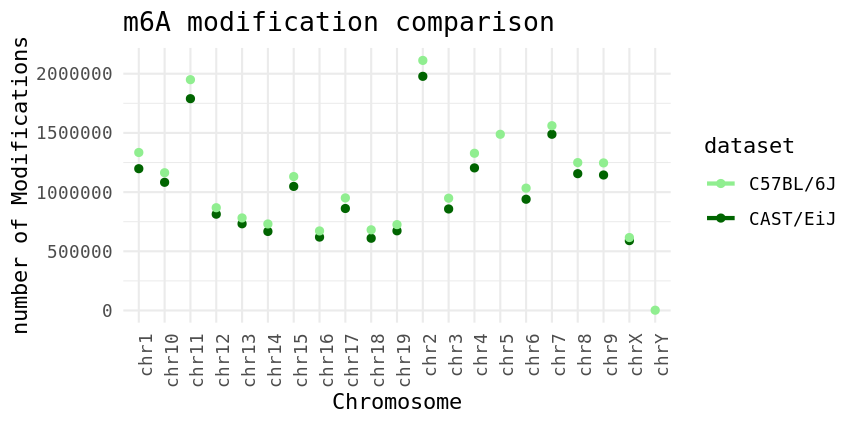
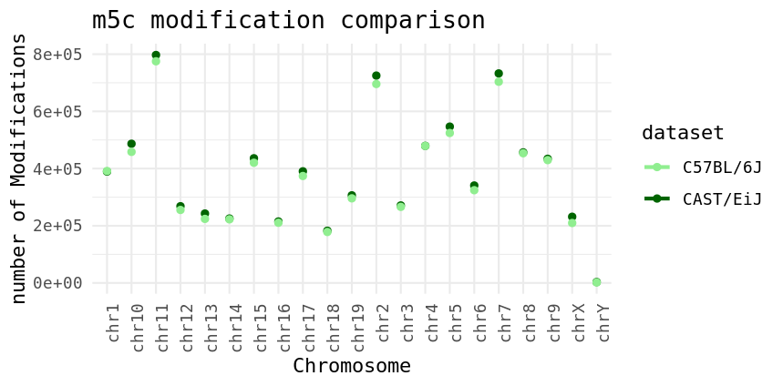

#### Week 10 (Independent Project)

### Epitranscriptomic analysis of direct RNA sequecing

   In this assignment, raw data produced by sequencing mice brain coreteces were processed to calculate number of RNA modifications (especifically m6A and m5C modifications) present in the epitranscriptome of this tissue. 

**Workflow and Data production**

 Two mouse strains, Black-6 and Castaneus, were disected and their brain cortex has been collected. RNA extraction has been performed on these tissues and the RNA was further enriched by selecting for mRNA species using oligo-dT coated beads. The mRNA yielded from this step was used to make ONT library and further sequenced on promethION flowcells. The raw data collected from this sequencer has been used for this assignment. 

1) Basecalling: Dorado basecaller trained and developed by ONT has been used to basecall the sequence data. This [Dorado script](code/scripts/week10/dorado-script.sh) has been used for this step.

2) Mapping: The basecalled data has been mapped using minimap2 package. This [minimap script](code/scripts/week10/minimap-script.sh) has been used for this step.

3) Modification calling: The modifications present on the sequecing data that has been basecalled and mapped are further extracted and outputted as a bedMethyl file. To do so, modkit package also developed by ONT has been used. This [modkit script](code/scripts/week10/modkit-script.sh) has been used for this step.

**Data visualization**

 The scripts used for this assignment call m6A and m5C modifications. In the following scatter plots m6A and m5C modifications is compared between the two mice strains introduced. 

<figure>
    
    <figcaption style="text-align: Left; color: gray;">Figure 1. m6A modification comparison between castaneus and black 6 cortices. </figcaption>
</figure>

<figure>
    
    <figcaption style="text-align: Left; color: gray;">Figure 2. m5C modification comparison between castaneus and black 6 cortices. </figcaption>
</figure>

This [R script](code/scripts/week10/plot-r.R) has been used ot generate the plots shown.