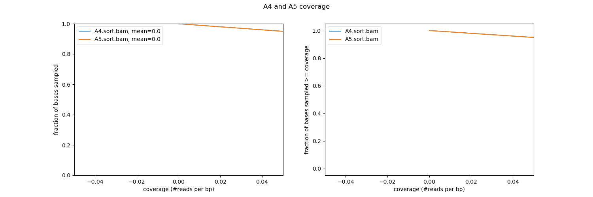

#####Week 4

In this week bam files from DNAseq were used to visualize mapping coverage using "Deeptools". This program outputs bedgraph which can be visualized using IGV software. The same sequencing data was also ran through SPAdes to assemble and analize. 
The scripts for this week can be found under [week 4](code/scripts/week4).

**Chromosome Coverage**

The nucleotide coverage of chromosome X from 1880000 to 2000000 nucleotides was vidsualized using a line plot.

<figure>
    
    <figcaption style="text-align: center;">Figure 3. Sequence GC%  for sequences ≤ 100kb.</figcaption>
</figure>