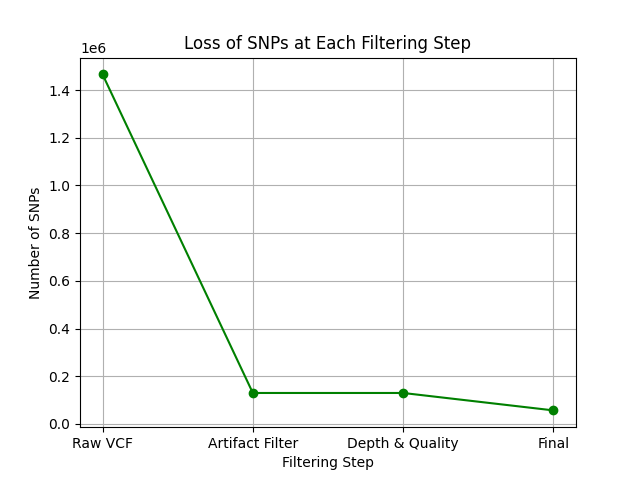
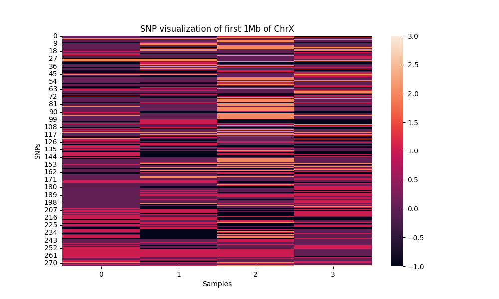
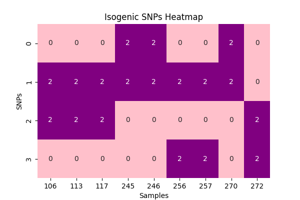

83
#### Week 5
In this week, bam files generated from mapping the DNAseq data were merge and GATK software was used to call the SNPs from the samples. Then the vcf files were filtered and visualized using seaborn python package.

**Filtering SNPs**
The vcf files has gone through series of filtering to retain the most meaningful SNPs. Three step of filtering has taken place as following order:
1) Retain high confident by removing: seq artifact, repitative and misaligned variants, poor quality metrics variants.
2) Filter read depth (reads > 3) and gene quality (quality score of >20).
3) Remove variants with no alternative allele || and variants with all alleles being alternative one

These steps have significantly decreased the number of SNPs called in the beginning and its shown in the following plot. Getting rid of artifacts has the most significant decease in number of SNPs.
<figure>
    
    <figcaption style="text-align: center;">Figure 1. Loss of SNPs is shown after each filtering step..</figcaption>
</figure>

**Visualizing SNPs using a heatmap**
The SNPs left aftering filtering has been index and visualized using Seasborn python package. Genotypes are represented as 0, 1 and 2, where the number represent that number of non-reference alleles. Missing genotypes are represented by -1.

<figure>
    
    <figcaption style="text-align: center;">Figure 2. SNP genotypes are characterized using a heatmap.</figcaption>
</figure>

**Visualizing isogenic SNPs at the frequency of 50%**
In this step, the SNPs where two of the strains are 0/0 and the other two 1/1 were considered and visualized using Seaborn python packages to plot a heatmap.

<figure>
    
    <figcaption style="text-align: center;">Figure 3. SNP of isogenic genotypes are characterized using a heatmap.</figcaption>
</figure>

The scripts and python notebook for this assignment can be found in [Scripts](code/scripts/week5) and [Python notebook](code/pynb).
