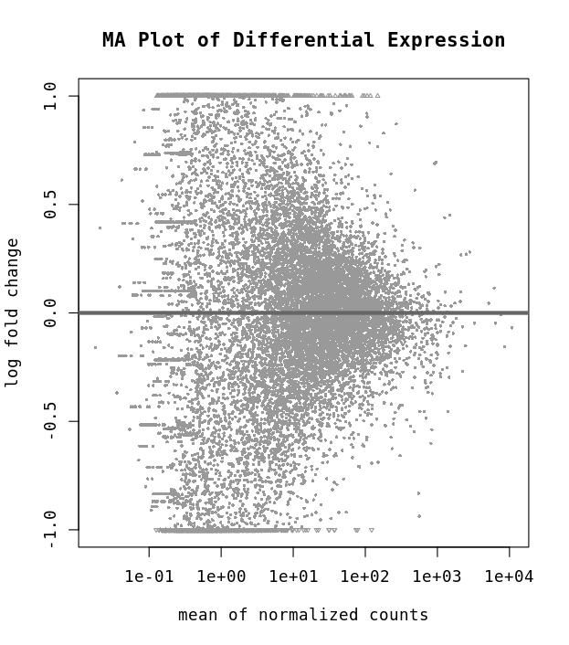
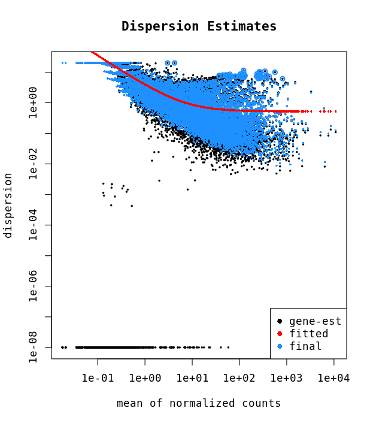
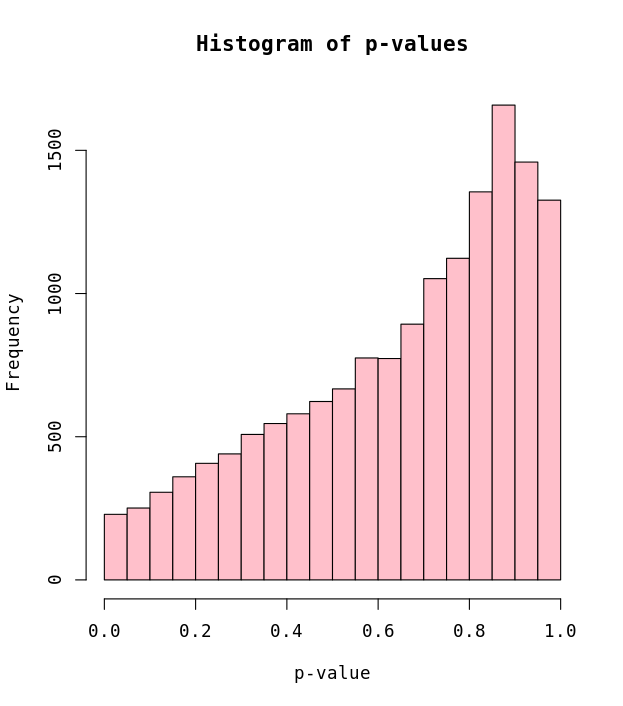
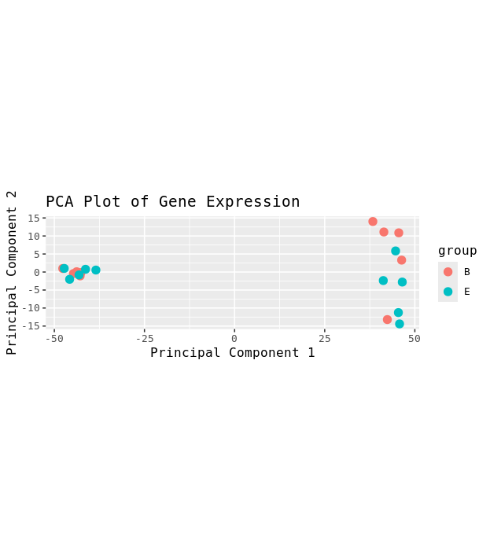
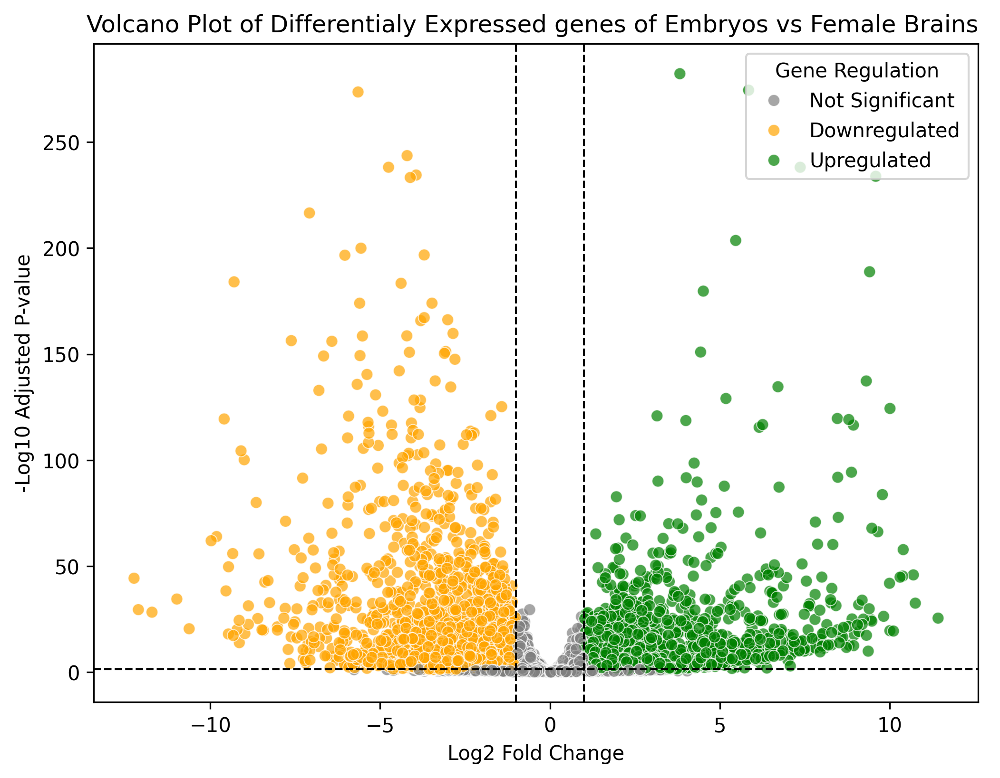
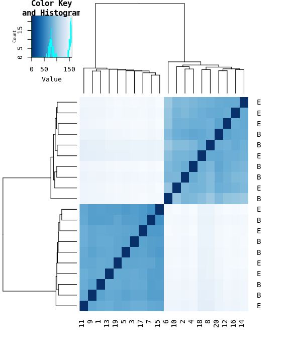
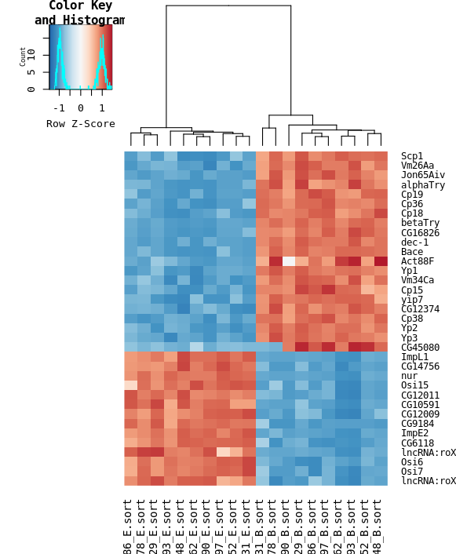

#### week 7 

In this week short-read RNAseq data was analyzed to detect differential gene expressions betweeen samples collect from embryos (E) vs. female brains (B). 

**FeatureCount**

FeatureCount is a bioinfomatic program to count number of genes expressed. This program uses bam files as input and a result table is outputed. For this assignment the following featureCounts switches were used:

-p = we have paired end reads in the bam
-T = number of cores/threads, this should match the resource request following SBATCH
-t exon = tells the program to counts reads aligning to each exon
-g gene_id = this is a default, but we want summaries are the gene level
-Q 30 = only Q30 quality mapping reads, typically PE reads that align uniquely
	(perhaps you have already filtered your bam).
-F GTF = format of annotation file, we use GTF, sometimes you have GFF
-a $gtf = path to GTF file, I use the Santa Cruz GTF, if I align to the Santa Cruz genome.
-o fly_counts.txt = output file (a giant table)

**Quality Control Plots**
The MA, histogram and dispersion plots below are representing the quality if the data used for this analysis.
<figure>
    
    <figcaption style="text-align: center;">Figure 1. MA plot of Embryonic vs. Brain tissues.</figcaption>
</figure>

<figure>
    
    <figcaption style="text-align: center;">Figure 2.Dispersion plot of Embryonic vs. Brain tissues.</figcaption>
</figure>

<figure>
    
    <figcaption style="text-align: center;">Figure 3.Histogram of p-values.</figcaption>
</figure>
**PCA plot**

The following PCA plot has been clustered based on sample's tissue code.

<figure>
    
    <figcaption style="text-align: center;">Figure 4. PCA analysis based on Tissue.</figcaption>
</figure>

**DEG Analysis**

To calculate the Differential Gene Expressions between the two tissues, python's pydeseq2 package has been used. The result of the DEG analysis is shown in the volcano plot below. 

<figure>
    
    <figcaption style="text-align: center;">Figure 5. DEG Analysis of Embryonic and Female Brain Tissues.</figcaption>
</figure>

**Distribution**

The following heatmap demonstrates a heatmap created from distribution matrix.

<figure>
    
    <figcaption style="text-align: center;">Figure 6. Heatmap shpwing tissue distribution.</figcaption>
</figure>

**Gene Clustering**

The heatmap created below demonstrates the gene clusters of each sample. 

<figure>
    
    <figcaption style="text-align: center;">Figure 7. Heatmap based on gene clustering.</figcaption>
</figure>

The code for DEG analysis is available in this [Python-Notebook](code/pynb/RNAseq.ipynb).
The R script used for the rest of the plots can be found under [week7.R](code/scripts/week7)
And the scritps ran on hpc3 can be found [here](code/scripts/week7).

