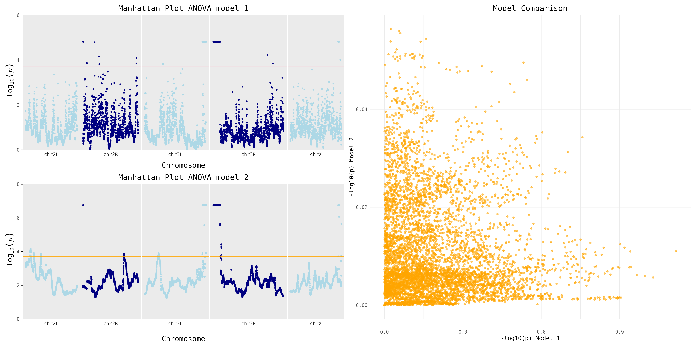

#### Week 9 

In this weeks assignment, material was focused on creating plots annd plot grids.

**Manhattan Plot**
The data retrieved from week 8 was used to plot manhattan plots shown below. 

1) Using ggplot to create the plots for two ANOVA models

''' R
model1 <- anova(lm(asin(sqrt(freq)) ~ treat + founder + treat:founder, data=mal2))
model2 <- anova(lm(asin(sqrt(freq)) ~ founder + treat %in% founder, data=mal2))
'''

<figure>
    
    <figcaption style="text-align: center;">Figure 1. Manhattan plot for SNPs called using two different ANOVA models.</figcaption>
</figure>

2) The 'myManhattan.R' script has been used to generate the following plots
 For this problem two manhattan plots were generated using the same data used in the previous section. In addittion, a scatter plot is showing the th SNPs that are called differently between the two models.
 
<figure>
    
    <figcaption style="text-align: center;">Figure 2. Manhattan plot for SNPs called using two different ANOVA models.Scatter plot showing differently called SNPs using two dofferent ANOVA models.</figcaption>
</figure>
 
 
 R script for this assignment can be found [here](code/scripts/week9/week9.R).